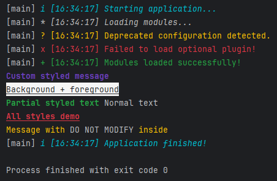

# JQuill — Java Console Utility Library
[](https://jitpack.io/#JakkoKoba/JQuill)
[](https://github.com/JakkoKoba/JQuill/packages)

**JQuill** is a lightweight Java library that simplifies console output, message formatting, and runtime debugging.  
Originally designed as a companion to **JCMD**, it provides a concise, styled interface for printing information, warnings, and logs with visual clarity.

---

## ✨ Features

- Intuitive methods for printing styled or prefixed messages
- Helpful utilities for runtime logging and debugging
- Works seamlessly with **JCMD** or any standalone Java project
- Lightweight, dependency-free, and fast

---

## 🧩 Requirements


| Java | Maven | Gradle |
|------|-------|-------|
| 17   | ✅     | ✅     |
| 20   | ✅     | ✅     |
| 24   | ✅     | ✅     |
| 25   | ✅     | ✅     |

---

## ⚙️ Installation

You can include **JQuill** from either **GitHub Packages** or **JitPack**.

### **A) GitHub Packages (Canonical Release)**

Add to your project’s `pom.xml`:

```xml
<repositories>
  <repository>
    <id>github</id>
    <url>https://maven.pkg.github.com/JakkoKoba/JQuill</url>
  </repository>
</repositories>

<dependency>
  <groupId>com.github.jakkokoba</groupId>
  <artifactId>jquill</artifactId>
  <version>1.0.1</version>
</dependency>
```
> ⚠️ Accessing GitHub Packages requires authentication. Add a GitHub token with read:packages scope in your ~/.m2/settings.xml:
```xml
<servers>
  <server>
    <id>github</id>
    <username>YOUR_GITHUB_USERNAME</username>
    <password>YOUR_GITHUB_TOKEN</password>
  </server>
</servers>
```
### B) JitPack (Public, No Authentication)

Add the JitPack repository and dependency:
```xml
<repositories>
  <repository>
    <id>jitpack.io</id>
    <url>https://jitpack.io</url>
  </repository>
</repositories>

<dependency>
  <groupId>com.github.JakkoKoba</groupId>
  <artifactId>JQuill</artifactId>
  <version>1.0.1</version>
</dependency>
```

## 🧠 Example Usage
```java
import org.jquill.Debug;
import org.jquill.Style;
import org.jquill.TimeMode;

public class Main {
    public static void main(String[] args) {
        Debug.setShowThread(true);                // Show thread names
        Debug.setTimeMode(TimeMode.ABSOLUTE);     // Use absolute timestamp

        // Basic Logging
        Debug.info("Starting application...");
        Debug.log("Loading modules...");
        Debug.warn("Deprecated configuration detected.");
        Debug.error("Failed to load optional plugin!");
        Debug.success("Modules loaded successfully!");

        // Styled Output
        Debug.println("Custom styled message", Style.BOLD.and(Style.PURPLE));
        Debug.println("Background + foreground", Style.BG_WHITE.and(Style.BLACK).and(Style.UNDERLINE));

        // Inline Open/Close
        Debug.print(Style.open(Style.GREEN, Style.BOLD));
        Debug.print("Partial styled text ");
        Debug.println(Style.close() + "Normal text");

        // Chained Styles
        Debug.println("All styles demo", Style.BOLD.and(Style.RED).and(Style.UNDERLINE));

        // Lock + Apply Example
        String lockedMessage = Style.lock("DO NOT MODIFY");
        String styled = Style.apply("Message with " + lockedMessage + " inside", Style.AMBER);
        Debug.println(styled);

        // Finish
        Debug.info("Application finished!");
    }
}
```
### Output:


---
### 🧾 Core Methods (Debug)

| Method                                                                                       | Description                                                   |
|----------------------------------------------------------------------------------------------|---------------------------------------------------------------|
| `info(String msg)`                                                                           | Prints an informational message.                              |
| `log(String msg)`                                                                            | Prints a general debug message.                               |
| `warn(String msg)`                                                                           | Prints a warning message.                                     |
| `error(String msg)`                                                                          | Prints an error message.                                      |
| `success(String msg)`                                                                        | Prints a success message.                                     |
| `print(String msg, Style... styles)`                                                         | Prints a message without newline, using optional text styles. |
| `println(String msg, Style... styles)`                                                       | Prints a styled message followed by a newline.                |
| `sleep(int seconds)`                                                                         | Pauses execution for a given number of seconds.               | |
| `setShowThread(boolean)`                                                                     | Toggle display of thread name prefix.                         |
| `setTimeMode(TimeMode)`                                                                      | Switch between elapsed or absolute timestamp.                 |
| `setTimeFormat(String)`                                                                      | Change timestamp format when using absolute mode.             |
| `setLevel(Level)`                                                                            | Filter messages by log level.                                 |

> ⚠️ Formatting behavior may depend on flags such as showType, showTime, and useRunTime.

### 🧾 Core Methods (Style)

| Method                               | Description                                                                                     |
| ------------------------------------ | ----------------------------------------------------------------------------------------------- |
| `and(Style other)`                   | Combines two or more styles into a single composite style. Example: `Style.BOLD.and(Style.RED)` |
| `getCode()`                          | Returns the ANSI code string of this style.                                                     |
| `apply(String msg, Style... styles)` | Applies one or more styles to a message, respecting locked segments.                            |
| `open(Style... styles)`              | Returns ANSI codes to open styles without resetting; useful for inline formatting.              |
| `close()`                            | Returns the ANSI reset code (`RESET`).                                                          |
| `lock(String msg)`                   | Marks text as locked, preventing re-styling during processing.                                  |
| `unlock(String msg)`                 | Removes lock delimiters from text.                                                              |
| `isLocked(String msg)`               | Returns `true` if the text contains lock delimiters.                                            |
| `fg(int r, int g, int b)`            | Creates a foreground color using RGB values.                                                    |
| `bg(int r, int g, int b)`            | Creates a background color using RGB values.                                                    |
| `fg(String hex)`                     | Creates a foreground color from a hex string, e.g., `"#FF0000"`.                                |
| `bg(String hex)`                     | Creates a background color from a hex string.                                                   |
| `fg256(int code)`                    | Creates a 256-color foreground style.                                                           |
| `bg256(int code)`                    | Creates a 256-color background style.                                                           |


### 🎨 Available Styles (Style)

| Constant        | Description                                      |
| --------------- | ------------------------------------------------ |
| `RESET`         | Clears all active styles.                        |
| `BOLD`          | Bold text.                                       |
| `DIM`           | Dim text intensity.                              |
| `ITALIC`        | Italic text.                                     |
| `UNDERLINE`     | Underlined text.                                 |
| `INVERT`        | Inverted colors.                                 |
| `STRIKETHROUGH` | Strikethrough text.                              |
| `BLACK`         | Black foreground.                                |
| `GRAY`          | Gray foreground.                                 |
| `LIGHT_GRAY`    | Light gray foreground.                           |
| `CHARCOAL`      | Dark gray/charcoal fg.                           |
| `SILVER`        | Silver foreground.                               |
| `WHITE`         | White foreground.                                |
| `RED`           | Red foreground.                                  |
| `ORANGE`        | Orange foreground.                               |
| `AMBER`         | Amber/yellow foreground.                         |
| `YELLOW`        | Yellow foreground.                               |
| `GOLD`          | Gold foreground.                                 |
| `LIME`          | Lime green foreground.                           |
| `GREEN`         | Green foreground.                                |
| `MINT`          | Mint green foreground.                           |
| `TEAL`          | Teal foreground.                                 |
| `CYAN`          | Cyan foreground.                                 |
| `SKY`           | Sky blue foreground.                             |
| `BLUE`          | Blue foreground.                                 |
| `INDIGO`        | Indigo foreground.                               |
| `PURPLE`        | Purple foreground.                               |
| `VIOLET`        | Violet foreground.                               |
| `LAVENDER`      | Lavender foreground.                             |
| `PINK`          | Pink foreground.                                 |
| `ROSE`          | Rose foreground.                                 |
| `CORAL`         | Coral foreground.                                |
| `BROWN`         | Brown foreground.                                |
| `SAND`          | Sand foreground.                                 |
| `BG_*`          | Background equivalents of all foreground colors. |

#### Core Semantic Aliases
| Constant  | Description                                 |
| --------- | ------------------------------------------- |
| `INFO`    | Informational messages (`CYAN + ITALIC`)    |
| `SUCCESS` | Success messages (`GREEN`)                  |
| `WARNING` | Warnings (`AMBER`)                          |
| `ERROR`   | Error messages (`RED`)                      |
| `LOG`     | General log messages (`SILVER + ITALIC`)    |
| `MUTED`   | Muted or less prominent text (`GRAY + DIM`) |


🧭 License

Released under the [MIT License](LICENSE).

© 2025 Jakko Koba